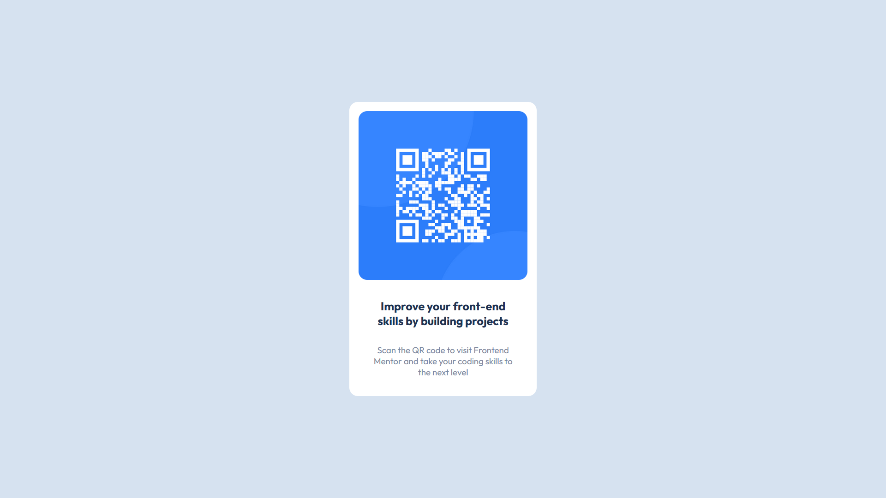

# Frontend Mentor - QR code component solution

This is a solution to the [QR code component challenge on Frontend Mentor](https://www.frontendmentor.io/challenges/qr-code-component-iux_sIO_H). Frontend Mentor challenges help you improve your coding skills by building realistic projects. 

## Table of contents

- [Overview](#overview)
  - [Screenshot](#screenshot)
  - [Links](#links)
- [My process](#my-process)
  - [Built with](#built-with)
  - [What I learned](#what-i-learned)
  - [Continued development](#continued-development)
  - [Useful resources](#useful-resources)
- [Author](#author)

## Overview

### Screenshot



### Links

- Solution URL: [Solution URL](https://github.com/AlbertoSocorro/qr-code-component-main)
- Live Site URL: [Live site URL](https://albertosocorro.github.io/qr-code-component-main/)

## My process

### Built with

- HTML5
- CSS
- Flexbox
- Visual Studio

### What I learned

Durante la elaboracion de este proyecto, he aprendido a declarar variables dentro de ":root", importar nuevas fuentes al proyecto, centrar divs y varias tecnicas responsive para el diseño web.

Entendi que podia declarar variables con ":root" para ser mas eficiente:

```css
:root {
    --color-white: hsl(0, 0%, 100%);
    --color-lightGray: hsl(212, 45%, 89%);
    --color-grayishBlue: hsl(220, 15%, 55%);
    --color-darkBlue: hsl(218, 44%, 22%);
    --font-parSize: 15px;
    --font-parFam: Outfit;
    --font-normWeight: 400;
    --font-boldWeight: 700;
}
```

Pude centrar la caja blanca de la siguiente forma:

```css
#whitebox {
  position: absolute;
  top: 50%;
  left: 50%;
  transform: translate(-50%, -50%);
  ...
}
```

Y tambien pude centrar el contenido de la caja blanca haciendo "display: flex":

```css
#whitebox {
  ...
  display: flex;
  flex-direction: column;
  align-items: center;
}
```

### Continued development

Para proximos proyectos, debo investigar sobre la propiedad display y todos sus posibles valores, y tambien para que sirve el "@media".

### Useful resources

- [FreeCodeCamp](https://www.freecodecamp.org/espanol/news/alineacion-vertical-css-como-centrar-un-div-un-texto-o-una-imagen-codigo-de-ejemplo-2/) - Me ayudo a centrar la caja blanca dentro del body con la propiedad "transform: translate()".
- [Mozilla](https://developer.mozilla.org/es/docs/Web/CSS/CSS_flexible_box_layout/Aligning_items_in_a_flex_container) - This is an amazing article which helped me finally understand XYZ. I'd recommend it to anyone still learning this concept.

## Author

- Frontend Mentor - [@AlbertoSocorro](https://www.frontendmentor.io/profile/AlbertoSocorro)
